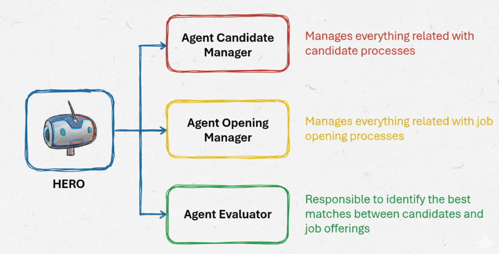

<p>
	
</p>

# hero

A base ReAct agent built with Google's Agent Development Kit (ADK)
Agent generated with [`googleCloudPlatform/agent-starter-pack`](https://github.com/GoogleCloudPlatform/agent-starter-pack) version `0.14.1`

## Project Structure

This project is organized as follows:

```
hero/
├── app/                 # Core application code
│   ├── agent.py         # Main agent logic
│   ├── server.py        # FastAPI Backend server
│   └── utils/           # Utility functions and helpers
├── .cloudbuild/         # CI/CD pipeline configurations for Google Cloud Build
├── deployment/          # Infrastructure and deployment scripts
├── notebooks/           # Jupyter notebooks for prototyping and evaluation
├── tests/               # Unit, integration, and load tests
├── Makefile             # Makefile for common commands
├── GEMINI.md            # AI-assisted development guide
└── pyproject.toml       # Project dependencies and configuration
```
## Architecture Diagram

<p align="center">
	
</p>

## Demo

Watch a quick demo of the application in action:

<p align="center">
	<a href="docs/Demo.mp4">▶️ Watch Demo Video</a>
</p>

## Requirements

Before you begin, ensure you have:
- **uv**: Python package manager (used for all dependency management in this project) - [Install](https://docs.astral.sh/uv/getting-started/installation/) ([add packages](https://docs.astral.sh/uv/concepts/dependencies/) with `uv add <package>`)
- **Google Cloud SDK**: For GCP services - [Install](https://cloud.google.com/sdk/docs/install)
- **Terraform**: For infrastructure deployment - [Install](https://developer.hashicorp.com/terraform/downloads)
- **make**: Build automation tool - [Install](https://www.gnu.org/software/make/) (pre-installed on most Unix-based systems)


## Quick Start (Local Testing)

Install required packages and launch the local development environment:

```bash
make install && make playground
```

# Features: Agents & Sub-Agents

This project implements a modular HR automation system using a main agent and specialized sub-agents. Below is a summary of the features:

## Main Agent: HR Coordinator
- Orchestrates HR tasks by delegating to sub-agents.
- Routes requests for candidate management, job openings, and candidate evaluation.
- Does not perform operations directly; acts as a smart router.

## Sub-Agents

### Candidate Manager Agent
- Stores candidate CVs in the database.
- Retrieves all candidate CVs, or by name/email.
- Deletes candidate CVs by name/email.
- Ensures data privacy and accuracy.

### Opening Manager Agent
- Adds new job openings to the database.
- Retrieves specific job openings or lists all openings.
- Deletes job openings by ID.
- Handles job opening information with confidentiality.

### Evaluator Agent
- Retrieves all candidates and job openings.
- Evaluates and matches candidates to job openings based on CV and job criteria.
- Provides detailed explanations for matches or states when no match is found.

All agents use Google ADK and interact with a PostgreSQL database, with secrets managed via Google Secret Manager.

## Commands

| Command              | Description                                                                                 |
| -------------------- | ------------------------------------------------------------------------------------------- |
| `make install`       | Install all required dependencies using uv                                                  |
| `make playground`    | Launch local development environment with backend and frontend - leveraging `adk web` command.|
| `make backend`       | Deploy agent to Cloud Run (use `IAP=true` to enable Identity-Aware Proxy) |
| `make local-backend` | Launch local development server |
| `make test`          | Run unit and integration tests                                                              |
| `make lint`          | Run code quality checks (codespell, ruff, mypy)                                             |
| `make setup-dev-env` | Set up development environment resources using Terraform                         |
| `uv run jupyter lab` | Launch Jupyter notebook                                                                     |

For full command options and usage, refer to the [Makefile](Makefile).


## Usage

This template follows a "bring your own agent" approach - you focus on your business logic, and the template handles everything else (UI, infrastructure, deployment, monitoring).

1. **Prototype:** Build your Generative AI Agent using the intro notebooks in `notebooks/` for guidance. Use Vertex AI Evaluation to assess performance.
2. **Integrate:** Import your agent into the app by editing `app/agent.py`.
3. **Test:** Explore your agent functionality using the Streamlit playground with `make playground`. The playground offers features like chat history, user feedback, and various input types, and automatically reloads your agent on code changes.
4. **Deploy:** Set up and initiate the CI/CD pipelines, customizing tests as necessary. Refer to the [deployment section](#deployment) for comprehensive instructions. For streamlined infrastructure deployment, simply run `uvx agent-starter-pack setup-cicd`. Check out the [`agent-starter-pack setup-cicd` CLI command](https://googlecloudplatform.github.io/agent-starter-pack/cli/setup_cicd.html). Currently supports GitHub with both Google Cloud Build and GitHub Actions as CI/CD runners.
5. **Monitor:** Track performance and gather insights using Cloud Logging, Tracing, and the Looker Studio dashboard to iterate on your application.

The project includes a `GEMINI.md` file that provides context for AI tools like Gemini CLI when asking questions about your template.


## Deployment

> **Note:** For a streamlined one-command deployment of the entire CI/CD pipeline and infrastructure using Terraform, you can use the [`agent-starter-pack setup-cicd` CLI command](https://googlecloudplatform.github.io/agent-starter-pack/cli/setup_cicd.html). Currently supports GitHub with both Google Cloud Build and GitHub Actions as CI/CD runners.

### Dev Environment

You can test deployment towards a Dev Environment using the following command:

```bash
gcloud config set project <your-dev-project-id>
make backend
```


The repository includes a Terraform configuration for the setup of the Dev Google Cloud project.
See [deployment/README.md](deployment/README.md) for instructions.

### Production Deployment

The repository includes a Terraform configuration for the setup of a production Google Cloud project. Refer to [deployment/README.md](deployment/README.md) for detailed instructions on how to deploy the infrastructure and application.
